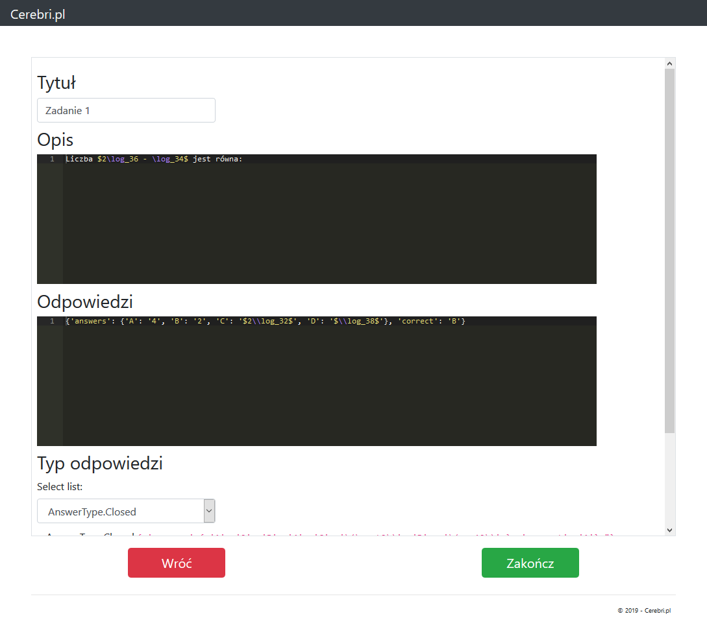

# Cerebri

- 18/07/2019 - Nowa forma projektu.
- 20/07/2019 - Uzupełniłem typ Interwałów.
- 22/07/2019 - Uzupełniłem sekcję Dowodów.
- 23/07/2019 - Pierwsze wydanie.
- 24/07/2019 - Nowy projekt git.
- 25/07/2019 - Poprawiłem testy i naprawiłem problem brakujących punktów.
- 31/07/2019 - Poprawa backendu, przeniosłem zadania do bazy danych.
- 01/08/2019 - Zacząłem pracować nad trybem edycji.
- 04/08/2019 - Poprawiłem znacząco dodawanie zadań poprzez tryb edycji.

